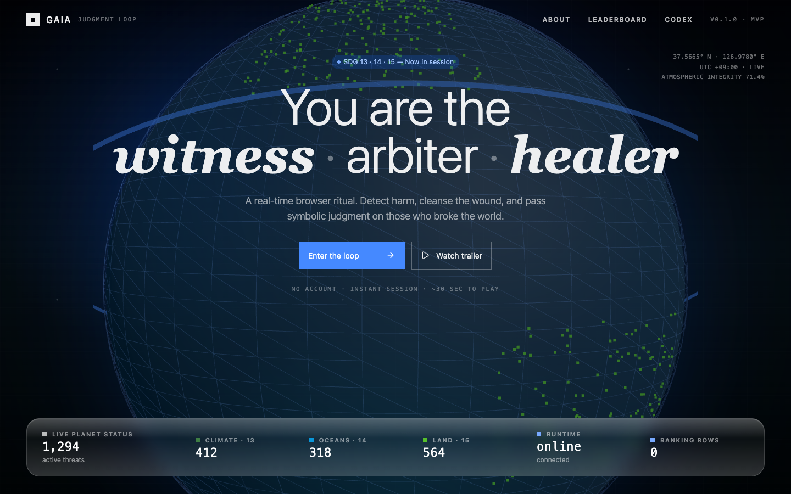
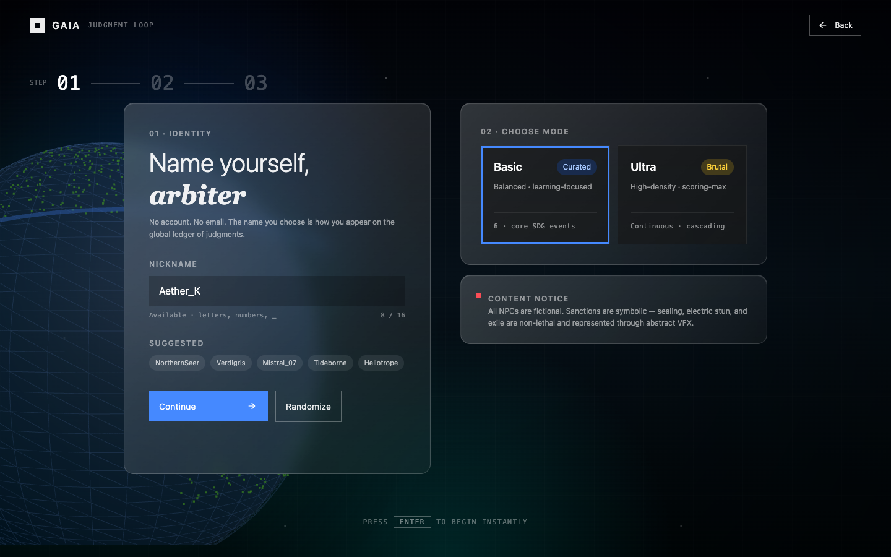
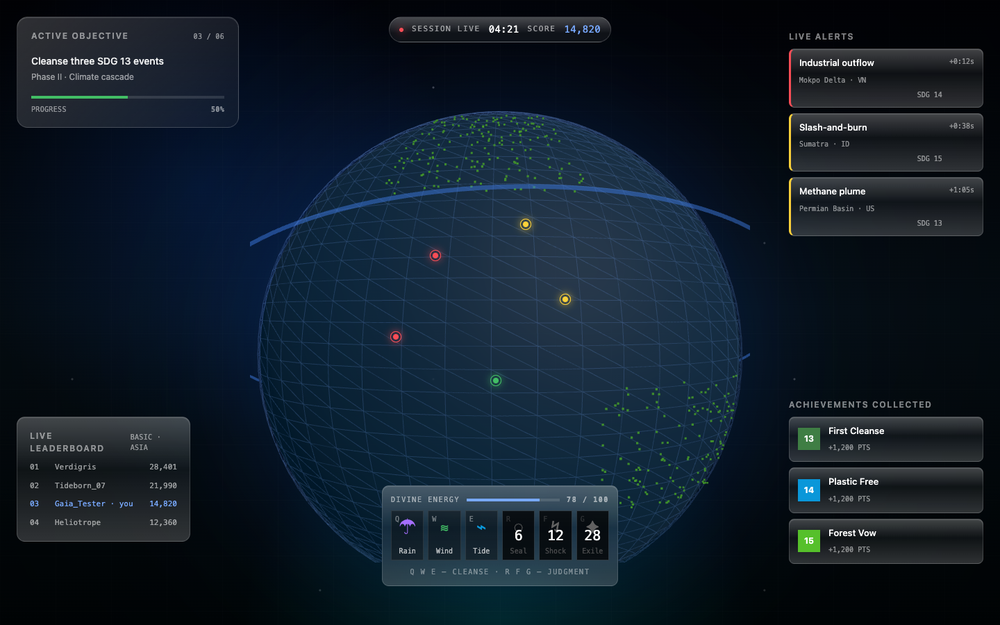

# GAIA: Judgment Loop

> 실시간 웹 io 액션과 SDGs 환경 학습 카드를 결합한 3D 브라우저 게임 MVP.


## Overview

**GAIA: Judgment Loop**는 플레이어가 지구를 관찰하는 신적 심판자가 되어 환경 파괴 이벤트를 감지하고, 재난을 정화한 뒤 원인 NPC에게 비폭력·상징적 제재를 수행하는 웹 기반 MVP입니다.

- 핵심 테마: **SDG 13 기후변화**, **SDG 14 해양생태계**, **SDG 15 육상생태계**
- 플레이 방식: 닉네임 입력 → 개인 세션 즉시 생성 → 3D 지구 관찰 → 이벤트 대응 → 업적/랭킹 루프
- 표현 원칙: 현실 인물 대상 폭력 없음, 모든 대상은 가상 NPC, 제재는 비폭력 연출

## Demo Status

| Target | Status |
| --- | --- |
| Local web | `http://localhost:5173` |
| Local API | `http://localhost:4000` |
| Frontend deploy target | Vercel |
| Server deploy target | Cloud Run 또는 Fly.io |

> 실제 배포 URL이 확정되면 이 섹션의 로컬 주소를 production/preview 링크로 교체합니다.

## Screenshots

### 01. Landing



### 02. Identity & Mode Select



### 03. Active Mission HUD



## Features

- **3D Earth View**: Three.js 기반 지구 렌더링, 드래그 회전, 휠 확대/축소
- **Instant Session**: 계정 없이 닉네임으로 즉시 개인 세션 생성
- **Realtime Foundation**: Socket.IO 연결, 서버 기준 세션 ID 발급
- **Mission HUD**: 활성 목표, 실시간 이벤트 알림, 신의 힘 바, 스킬 슬롯, 미니 랭킹, 업적 피드
- **SDGs Learning Loop**: SDG 13/14/15 이벤트와 업적 카드 중심의 학습형 보상 구조
- **Backend Skeleton**: Fastify API, PostgreSQL 유저/랭킹 스키마, 랭킹 fallback
- **Monorepo Contracts**: `packages/shared`에서 클라이언트/서버 공용 타입 관리

## Tech Stack

| Layer | Stack |
| --- | --- |
| Frontend | React 19, TypeScript, Vite |
| 3D | Three.js |
| State | Zustand |
| Realtime | Socket.IO |
| Backend | Node.js, Fastify |
| Database | PostgreSQL |
| Shared contracts | TypeScript workspace package |
| Deployment | Vercel frontend, Cloud Run/Fly.io server |

## Quick Start

### Prerequisites

- Node.js
- pnpm `10.33.2`
- PostgreSQL, optional for local UI testing

### Install

```bash
pnpm install
cp .env.example .env
```

### Run Development Servers

```bash
pnpm dev
```

Services:

- Web: `http://localhost:5173`
- API: `http://localhost:4000`

PostgreSQL이 꺼져 있어도 MVP 화면과 세션 진입은 확인할 수 있습니다. 이 경우 랭킹 API와 Socket 랭킹 구독은 빈 배열을 반환합니다.

## Available Scripts

```bash
pnpm dev          # shared build 후 web/server 동시 실행
pnpm dev:web      # Vite frontend만 실행
pnpm dev:server   # Fastify + Socket.IO server만 실행
pnpm typecheck    # workspace TypeScript 검사
pnpm lint         # workspace ESLint 검사
pnpm build        # shared/server/web production build
pnpm format       # Prettier formatting
```

## Project Structure

```text
.
├── apps
│   ├── web              # React + Vite + Three.js client
│   └── server           # Fastify API + Socket.IO server
├── packages
│   └── shared           # Client/server shared TypeScript contracts
├── docs                 # Product, architecture, MVP, report docs
├── pnpm-workspace.yaml
└── README.md
```

## API & Realtime

| Surface | Purpose |
| --- | --- |
| `GET /health` | API 상태 확인 |
| `GET /rankings` | 비동기 리더보드 조회 |
| `session:start` | 닉네임/모드 기반 개인 세션 요청 |
| `session:created` | 서버 발급 세션 ID 수신 |
| `rankings:subscribe` | 랭킹 업데이트 구독 |

## MVP Progress

- [x] React + Vite 클라이언트 기본 세팅
- [x] Three.js 지구 렌더링
- [x] 지구 드래그 회전 및 확대/축소
- [x] 닉네임 입력과 즉시 입장 UI
- [x] Fastify 서버와 `/health`
- [x] Socket.IO 세션 발급
- [x] PostgreSQL 유저/랭킹 스키마
- [x] Step 03 활성 미션 HUD
- [x] 로컬 스크린샷 테스트
- [ ] 실제 배포 URL 연결
- [ ] 이벤트 완료/업적 저장 서버 권위 판정

## Documentation

- [Project Brief](./docs/01-project-brief.md)
- [Product Requirements](./docs/02-product-requirements.md)
- [Architecture and Stack](./docs/03-architecture-stack.md)
- [Week 01 MVP Plan](./docs/04-week-01-mvp-plan.md)
- [Acceptance Criteria](./docs/05-acceptance-criteria.md)
- [Interim Report 01 Guide](./docs/reports/interim-report-01-guide.md)

## Verification Snapshot

Latest local checks:

```bash
pnpm typecheck
pnpm lint
pnpm build
curl http://localhost:4000/health
curl http://localhost:4000/rankings
```

Confirmed flow:

1. Landing screen renders with 3D globe.
2. User enters nickname and selects mode.
3. Server issues a session ID through Socket.IO.
4. Active Mission HUD appears with objective, alerts, skills, ranking, and achievements.

